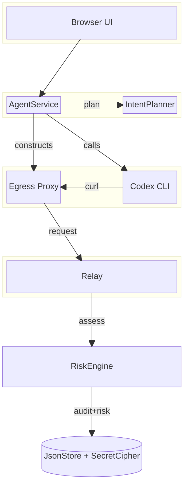
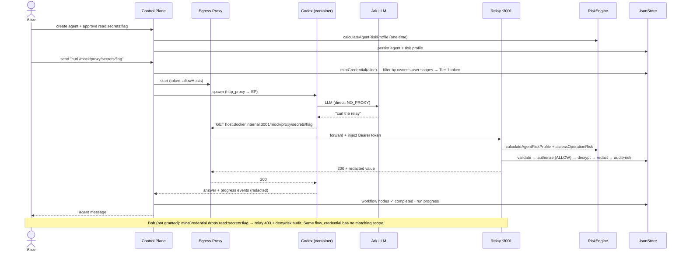

# Volc Agent Launchpad — Identification and Authorisation

> An accountability + enforcement layer for AI agents: sensitive resources sit
> behind a relay that verifies credentials + capabilities, and every decision
> is recorded with a risk assessment.

## Inspiration

As AI agents become capable of taking real actions, we realized that simply
giving an agent access to tools isn't enough. We need to know what an agent
tried to do, whether it was authorized, and how risky that action was.

We wanted to explore what an accountability layer for AI agents could look
like: a system where sensitive resources sit behind an enforcement boundary
and every decision leaves an auditable trail.

## What We Built

We extended our agent platform with a protected-resource relay,
capability-based authorization, and risk-aware audit trail.

Agent requests to protected resources are routed through the relay, where the
system verifies the agent's credentials and required capabilities before
allowing the request to proceed. Unauthorized requests are blocked rather than
reaching the underlying resource.

Every decision is recorded with information about the requested capability,
resource, authorization result, and risk assessment. This lets us distinguish
between normal agent behavior and suspicious or unauthorized activity.

Our demo shows both sides of the system:

- An authorized request for a development resource succeeds.
- An unauthorized attempt to access a production resource is denied and
  recorded as a risk-bearing event.
- Repeated denied requests provide additional context for assessing suspicious
  behavior.

## How We Built It

We implemented the governance layer around the existing agent runtime rather
than relying on the model to enforce its own permissions.

The relay acts as the enforcement point:

```text
Agent Request → Credential Validation → Capability Check → Resource Access
```

The result of each decision is then written to the audit trail, alongside a
risk assessment based on the operation and its context.

This architecture means that even if an agent wants to access something it
shouldn't, the protected resource remains behind a separate authorization
boundary.

## What We Learned

The biggest lesson was that prompt-level instructions are not security
controls. Telling an agent not to access a resource is fundamentally
different from enforcing that restriction at the resource boundary.

We also learned that audit logs become much more useful when they capture
decisions and context, rather than simply recording that an API request
happened. A denied request, the capability it required, and the reason it was
denied provide much more actionable information.

## Challenges

One challenge was making the demo reliably exercise the protected-resource
path. An agent can sometimes answer a request from its existing context
without actually making an external call, which means a natural-language
prompt alone isn't sufficient to demonstrate enforcement.

We addressed this by making the protected resource and relay explicit parts
of the architecture, allowing us to demonstrate a complete allow and deny flow
through the same enforcement boundary.

Another challenge was balancing useful auditing with data protection. The
system needs enough information to understand what happened without
unnecessarily exposing the sensitive resource itself. This led us to make the
audit trail about actions, authorization, and risk, rather than storing
sensitive resource contents.

Ultimately, the project reinforced our belief that trustworthy AI agents need
more than intelligence—they need boundaries, visibility, and accountability.

## The middleware problem & rationale

AI agents that can call tools and take real actions need more than
intelligence — they need boundaries, visibility, and accountability. Three
problems drove this work:

- **Prompt-level instructions are not security controls.** Telling an agent
  "don't access X" doesn't prevent it from trying. The model cannot enforce its
  own permissions.
- **Agents act on behalf of users.** An agent owned by User A must not
  automatically inherit User B's access. Identity and authorization must be
  enforced server-side, at the resource boundary — not in the prompt.
- **Bare API logs aren't enough.** Knowing an API was called isn't the same as
  knowing what was attempted, whether it was allowed, and how risky it was.

The hackathon's **Bouncer** track asks teams to separate the human user from
the agent acting for that user: create User A, User B, and an Agent principal
owned by A; allow the agent to read A's mock resource; deny B's resource in
the backend; and record the human, agent, action, resource, and decision. A
login screen without server-side authorization does not qualify.

Our answer puts the enforcement at the resource boundary (the relay), not in
the agent or the prompt.

## Design summary

The system layers four trust zones onto the agent platform:

- **Operator** — the browser UI (Agents, Vault, Permissions, Owner, Logs).
  Mock identity via `X-Mock-User` (separate from the shared `APP_AUTH_TOKEN`,
  which is not identity).
- **Control Plane :3000** — `AgentService` and `IntentPlanner` are a coupled
  service that mints scoped credentials, plans intents, and runs turns.
  `RiskEngine` scores the agent once at create.
- **Per-run Runtime** — a disposable container runs the Codex CLI. The agent
  never sees the Tier-1 token; a per-run `Egress Proxy` injects it only on
  allowlisted hosts/paths.
- **Protected Resource :3001** — the relay validates the credential, checks
  capabilities (scope match), decrypts the secret, redacts, and writes a
  risk-stamped audit row.

The enforcement seam is `mintCredential → egress-proxy → relay`: the operator
grants a user inherent scopes → `mintCredential` keeps only scopes the owner
holds → the egress proxy injects that token → the relay authorizes against the
credential's scopes and writes a risk-stamped audit row.

### Block diagram — trust zones & components (top-down)



### Sequence diagram — end-to-end enforcement (Alice allow / Bob deny)



**How to read it at a glance**

- **The enforcement seam** is the `mintCredential → egress-proxy → relay`
  chain: the operator grants Alice a user scope → `mintCredential` keeps only
  scopes Alice holds → the egress proxy injects that token → the relay
  authorizes against the credential's scopes + writes a risk-stamped audit row.
- **The agent (Codex) never touches the token** — it only curls
  `host.docker.internal:3001`; the per-run egress proxy (wired via lowercase
  `http_proxy`) adds `Authorization: Bearer …` on allowlisted hosts only.
- **Risk engine + workflow + progress** are the observability spine:
  `RiskEngine` scores at agent create + at the relay; the relay stamps
  `operationRiskLevel/Score/Factors` into the audit; workflow nodes track the
  run lifecycle; Codex progress events are captured/redacted/streamed — all
  rendered in the UI's Logs tab.

## Code Repository

### Requirements

- Node.js 22+
- npm 10+
- Docker, Colima, or Podman
- A Volcengine Ark API key + model endpoint that supports the Responses API

Codex CLI is included in the runtime image; it is not required on the host.

### Setup

```bash
git clone https://github.com/RyanTYT/CodeJam.git CodeJam
cd CodeJam
cp .env.example .env
# edit .env: ARK_API_KEY, ARK_MODEL (a real ep-… endpoint id)
npm run poc
```

`npm run poc` builds the runtime image (with Codex CLI + curl) and starts the
control plane (`:3000`) + mock resource relay (`:3001`) in container mode.
Open <http://localhost:3000>.

### Configuration

`.env` (gitignored) holds `ARK_API_KEY`, `ARK_MODEL`, `ARK_BASE_URL`, and
`REAL_UPSTREAM_SECRET`. `APP_AUTH_TOKEN` is optional — only required for a
non-loopback production deploy; leave it commented for local dev (no unlock
screen). The dev server auto-loads `.env` via Node's `process.loadEnvFile`.

### Development

```bash
npm install
npm run dev      # control plane (:3000) + web (:5173), hot reload
npm run check    # typecheck + tests + build (must be green)
```

## Automated tests

- **68 tests across 10 files** — `npm run test` (vitest).
- **`npm run check`** — typecheck + tests + build.
- **`npm run test:e2e`** — Playwright end-to-end (IAM audit-log UI).

Coverage includes: the capability model, relay allow/deny paths, user-scope
delegation gating (Alice allow / Bob deny), risk-engine scoring, workflow-node
lifecycle, progress-event dedup, audit scoping (admin sees all, users see
their own), and a full-stack IAM functional test that exercises
create → run → workflow → relay allow/deny → risk-stamped audit.

## Demo steps

### One-time setup (as admin)

1. Open <http://localhost:3000> (admin user).
2. **Vault** → add a secret (e.g., key `flag`, value + redacted view).
3. **Permissions → Users** → grant `read:secrets:flag` to **Alice** (not Bob).

### Allow path (Alice)

1. Switch to **Alice**. **Create Agent** → intent `read the flag secret` →
   **Plan permissions** (proposes `read:secrets:flag`) → approve → **Create**.
2. Send: `curl -s http://host.docker.internal:3001/mock/proxy/secrets/flag`
3. Expect **200** + the redacted flag value. The audit trail shows an
   **allow** with the capability, resource, and risk assessment.

### Deny path (Bob)

1. Switch to **Bob**. Create an agent the same way (intent
   `read the flag secret`, approve `read:secrets:flag`).
2. Send the same curl prompt.
3. Expect **403**. The audit trail shows a **deny** (`capability not
   granted`) — `mintCredential` dropped the scope because Bob's owner lacks the
   user-scope. Repeated denials raise the operation risk score.

### Live enforcement check (no agent needed)

```bash
# mint a credential as Alice (has read:secrets:flag) → relay 200
T=$(curl -s -X POST -H "X-Mock-User: admin" -H "Content-Type: application/json" \
  -d '{"userId":"alice","scopes":["read:secrets:flag"]}' \
  http://127.0.0.1:3000/api/debug/mint-credential \
  | python3 -c "import sys,json;print(json.load(sys.stdin)['token'])")
curl -s -H "Authorization: Bearer $T" http://127.0.0.1:3001/mock/proxy/secrets/flag   # 200

# mint as Bob (lacks the user-scope) → relay 403
T=$(curl -s -X POST -H "X-Mock-User: admin" -H "Content-Type: application/json" \
  -d '{"userId":"bob","scopes":["read:secrets:flag"]}' \
  http://127.0.0.1:3000/api/debug/mint-credential \
  | python3 -c "import sys,json;print(json.load(sys.stdin)['token'])")
curl -s -H "Authorization: Bearer $T" http://127.0.0.1:3001/mock/proxy/secrets/flag   # 403
```

## Limitations

- **Single-node proof of concept.** `JsonStore` is a single-process JSON file;
  not a multi-tenant or production system.
- **Mock identity.** `X-Mock-User` is a stand-in for real auth;
  `APP_AUTH_TOKEN` is a shared demo token, not user identity.
- **Mock protected resource.** The relay guards a local mock secret store,
  not a real database or external API.
- **Risk engine is observability-only.** `requiresApproval` is recorded in the
  audit and shown in the UI, but there is no pre-flight enforcement gate that
  blocks high-risk operations before they run.
- **Agent risk profile is computed once at create** and not refreshed as audit
  history grows (operation-level risk is fresh per call).
- **Container sandbox.** Local POC may fall back to `danger-full-access` inside
  the disposable container on kernels without Landlock. Use a scoped demo
  model key; do not place unrelated credentials or data in the POC.

## No secrets

- `.env` is gitignored; no API keys, tokens, or passwords are committed.
- The Ark API key never reaches the browser; it is used server-side only.
- Secrets in the vault are encrypted at rest (AES-256-GCM via `SecretCipher`)
  and exposed only as redacted views.
- The audit trail records **actions, authorization decisions, and risk** —
  never sensitive resource contents.
- No real credentials appear in source, logs, traces, or screenshots.
