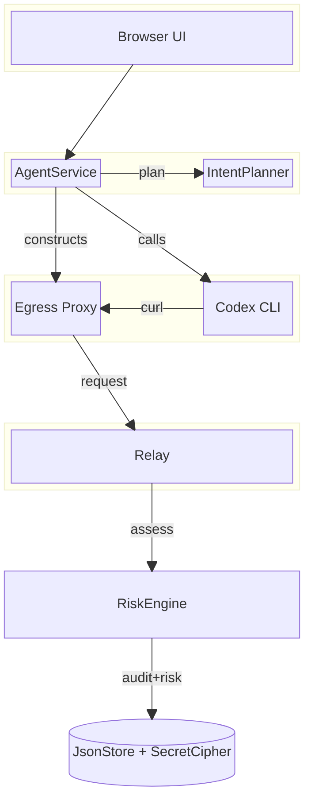
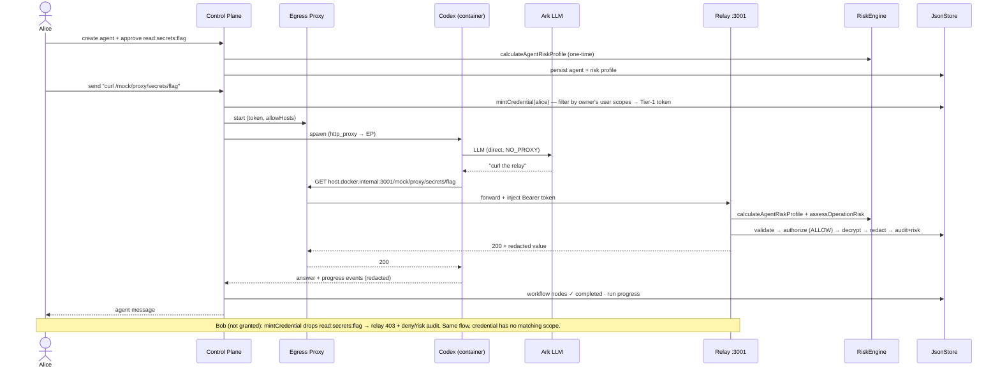

---

## Bouncer track — full architecture (block + sequence)

The Bouncer track layers identity, authorization, and an audit trail onto the
base control plane. The operator grants users inherent scopes; agents only get
credentials for scopes their owner holds; a per-run egress proxy injects the
agent's Tier-1 token; the relay enforces it and writes a risk-stamped audit
row. (Risk engine + workflow + progress events are the observability spine
added on top of the enforcement seam.)

### Block diagram — trust zones & components (top-down)

**Four trust zones** = the four groups (top → bottom = the trust flow):

- **Operator** — the browser UI (Agents, Vault, Permissions, Owner, Logs).
  Mock identity via `X-Mock-User` (separate from the shared `APP_AUTH_TOKEN`,
  which is not identity).
- **Control Plane :3000** — operator-owned; `AgentService` calls
  `IntentPlanner` to propose baseline/elevated scopes at agent create
  (`AS → IP`, "plan"), then mints scoped credentials + runs the turn
  (`AS → EP`, "mint"). (It also calls `RiskEngine` once at create to store an
  agent risk profile — not drawn, to keep the enforcement flow vertical.)
- **Per-run Runtime** — disposable; `Codex CLI` never sees the Tier-1 token —
  `Egress Proxy` injects it only on allowlisted hosts/paths.
- **Protected Resource :3001** — the relay validates the credential, authorizes
  against its scopes, decrypts the secret, redacts, then calls `RiskEngine`.

**`RiskEngine`** sits between the relay and the store (the risk-stamped audit
path). It's a pure-function library the relay calls on both the allow + deny
paths (`calculateAgentRiskProfile` + `assessOperationRisk`); the relay stamps
the result (`operationRiskLevel` / `Score` / `Factors`) into the audit row and
persists it — so the diagram shows `RL → RE → DB` (assess, then audit+risk to
the store).

**`JsonStore`** — the shared persistence layer: agents, credentials, secrets
(encrypted via `SecretCipher`), audit, workflow nodes, risk profiles.

The LLM call to Ark (direct, `NO_PROXY`) and the per-step timing are shown in
the sequence diagram below.

### Sequence diagram — end-to-end enforcement (Alice allow / Bob deny)

### How to read it at a glance

- **The enforcement seam** is the `mintCredential → egress-proxy → relay` chain:
  the operator grants Alice a user scope → `mintCredential` keeps only scopes
  Alice holds → the egress proxy injects that token → the relay authorizes
  against the credential's scopes + writes a risk-stamped audit row.
- **The agent (Codex) never touches the token** — it only curls
  `host.docker.internal:3001`; the per-run egress proxy (wired via lowercase
  `http_proxy`) adds `Authorization: Bearer …` on allowlisted hosts only.
- **Risk engine + workflow + progress** are the observability spine:
  `RiskEngine` scores at agent create + at the relay; the relay stamps
  `operationRiskLevel/Score/Factors` into the audit; workflow nodes track the
  run lifecycle; Codex progress events are captured/redacted/streamed — all
  rendered in the UI's Logs tab.
