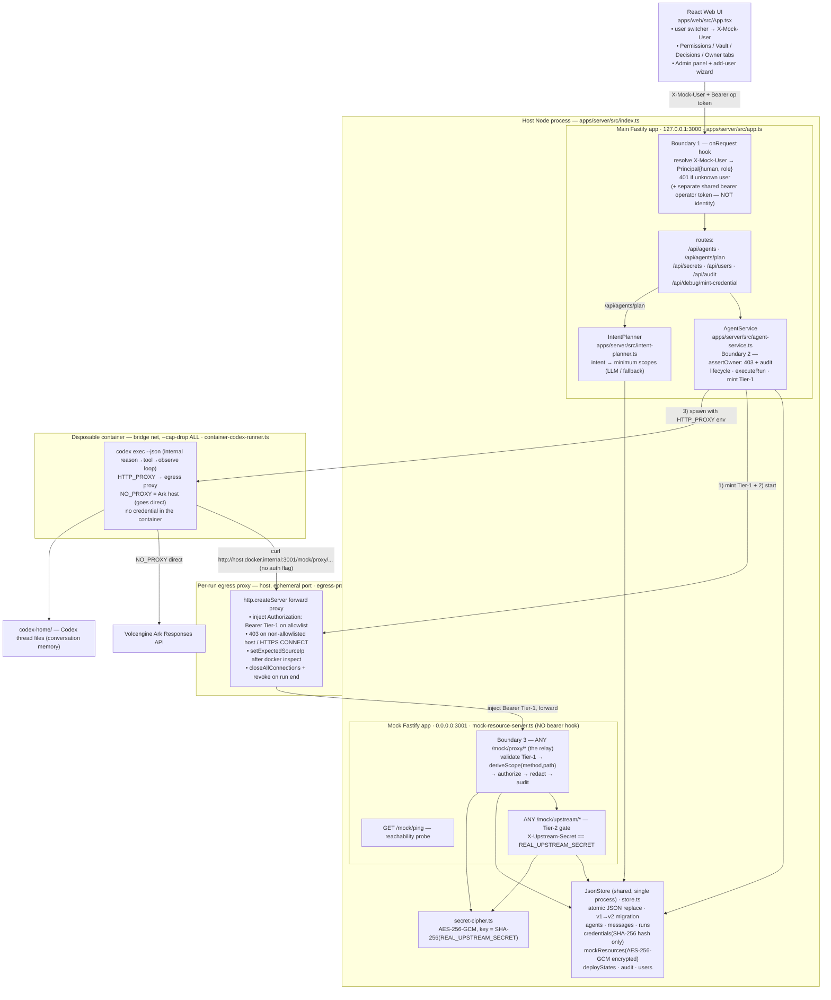
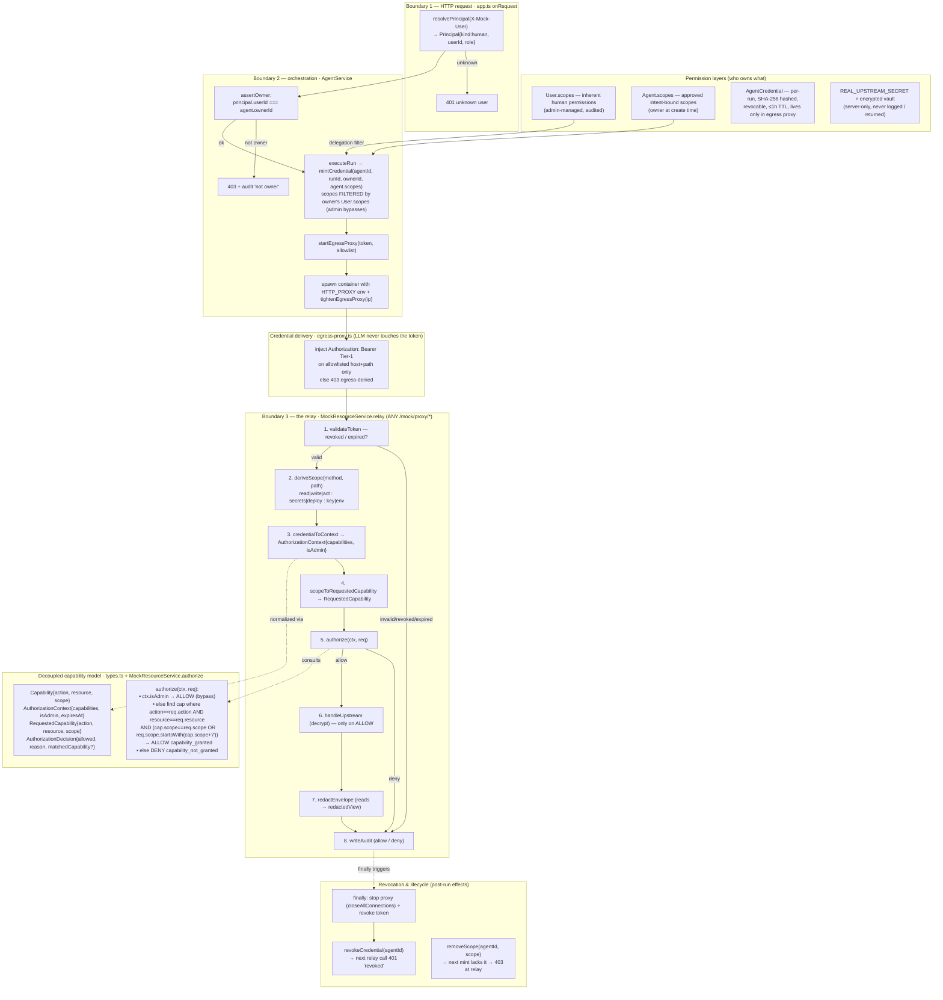

# Permissions Manager Middleware — Architecture

The Bouncer track (identity & authorization) **is** the permissions manager
middleware: it gives Agents safe, secure, scoped, revocable permissions to act
on protected resources, enforced in the backend — not the UI.

This document has two diagrams:

1. **Full architecture** — the whole Volc Agent Launchpad system with the
   permission middleware integrated, and the trust boundary.
2. **Focused architecture** — the permissions manager middleware itself: the
   credential lifecycle, the three enforcement boundaries, the decoupled
   capability model, and revocation.

---

## Core ideas (confirmed in code)

1. **Two distinct principals.** A *human* principal (`X-Mock-User` →
   `Principal{kind:"human"}` in `apps/server/src/app.ts onRequest`) owns/drives
   an Agent; an *agent* principal is a scoped, revocable **Tier-1 credential**
   (`AgentCredential`, SHA-256 hashed, 1h TTL) the Agent presents to protected
   resources. The operator bearer token is explicitly *not* identity — it is
   kept separate.

2. **Three enforcement boundaries:**
   - **Boundary 1 — HTTP request** (`app.ts onRequest`): attach `Principal{human}`
     from `X-Mock-User`; 401 if unknown user.
   - **Boundary 2 — service/orchestration** (`AgentService.assertOwner` in
     `agent-service.ts`): a human may only drive an Agent they own; else 403 +
     audit.
   - **Boundary 3 — the relay** (`MockResourceService.relay` via
     `ANY /mock/proxy/*`): validate Tier-1 → derive required scope from
     `(method, path)` → `authorize()` → redact → audit. Upstream is never
     called on deny.

3. **A decoupled capability model** (`apps/server/src/types.ts`: `Capability`,
   `AuthorizationContext`, `RequestedCapability`, `AuthorizationDecision`;
   `MockResourceService.authorize`). It intentionally knows nothing about
   tokens/JWTs — it only answers "does this context contain the required
   capability?" Admin bypasses; otherwise a granted capability matches when
   `action` + `resource` match AND (`scope` equal OR
   `requested.scope.startsWith(cap.scope + "/")`).

**Credential delivery (the security linchpin):** the Agent container never
holds a credential. `AgentService.executeRun` mints a Tier-1 token and starts a
**per-run egress proxy** (`egress-proxy.ts`) on the host; the container gets
`HTTP_PROXY`/`http_proxy` env (set in `container-codex-runner.buildContainerRunArgs`)
so curl traffic is routed through the proxy, which **injects**
`Authorization: Bearer <Tier1>` only on allowlisted hosts/paths and 403s
everything else. After `docker inspect` reveals the container's bridge IP, the
proxy is tightened to that source IP (spoof resistance rests on the existing
`--cap-drop ALL` + `no-new-privileges`).

**Redaction & encryption at rest:** the raw `value` of a secret **never**
reaches the container — the relay returns a `redactedView`; secrets are
AES-256-GCM encrypted at rest (`secret-cipher.ts`, key derived from
`REAL_UPSTREAM_SECRET`).

**Least privilege + delegation:** at create time the owner runs an intent-bound
plan (`IntentPlanner.plan` → LLM or keyword fallback → `classifyScope` into
baseline/elevated/unknown); approved scopes land on `Agent.scopes`. At mint
time, `mintCredential` **filters** the requested scopes by the owner's inherent
`User.scopes` (admin bypasses) — so an admin's user-permission grant actually
gates Agent access (proven by the `user-scope delegation gating` tests in
`mock-resource.test.ts`).

---

## Diagram 1 — Full architecture (whole system + trust boundary)

---

## Diagram 2 — Focused: the permissions manager middleware and how it works

Zooms into the credential lifecycle, the three boundaries, the decoupled
capability model, and revocation — i.e. *how* an Agent gets and uses a
permission safely.

---

## How a single Agent turn flows through the middleware

**Happy path:**

1. **Identity (B1):** user picks "alice" in the UI → `X-Mock-User: alice` on
   every request (`apps/web/src/api.ts`). `app.ts onRequest` calls
   `service.resolvePrincipal("alice")` → `Principal{human, userId:"alice",
   role:"user"}`. Unknown user → 401.
2. **Ownership (B2):** `POST /api/agents/:id/messages` →
   `AgentService.sendMessage` → `getAgent` → `assertOwner`. Bob touching
   Alice's Agent → 403 + `audit{decision:"deny", reason:"not owner"}`.
3. **Mint + deliver:** `executeRun` → `mockResourceService.mintCredential(...)`
   (scopes filtered by Alice's `User.scopes`; token stored as SHA-256 hash) →
   `startEgressProxy` → container spawned with `HTTP_PROXY`/`http_proxy`
   pointing at the proxy, `NO_PROXY` = Ark host. After `docker inspect`,
   `tightenEgressProxy(containerIp)` pins the proxy to that source IP.
4. **Agent acts:** Codex emits
   `curl http://host.docker.internal:3001/mock/proxy/secrets/dev-db-url`
   (no auth flag). The egress proxy intercepts, injects
   `Authorization: Bearer <Tier1>`, forwards to the relay.
5. **Authorize (B3):** `relay()` → `validateToken` →
   `deriveScope("GET","secrets/dev-db-url")` = `read:secrets:dev-db-url` →
   `credentialToContext` → `scopeToRequestedCapability` → `authorize()`.
   Alice's credential holds `read:secrets:dev-db-url` → ALLOW →
   `handleUpstream` (decrypts) → `redactEnvelope` returns
   `{key, value: redactedView}` → `writeAudit{decision:"allow"}`. The raw
   value never leaves the server.

**Deny cases (all backend, all audited):**

- Wrong scope → 403 `capability not granted`, upstream untouched.
- `act:deploy:prod` with only `act:deploy:dev` → 403, `prod` deployState
  stays `false`.
- Revoked token → 401.
- Bypass via `curl --noproxy` to `/mock/upstream/*` → 401 (no Tier-2 secret).
- Egress to a non-allowlisted host → 403.

**Revocation:**

- `POST /api/agents/:id/revoke-credential` → next relay call 401.
- `POST /api/agents/:id/scopes/revoke` → next mint omits that scope → 403 at
  relay.
- On run end, `finally` stops the proxy and revokes the token.

---

## Key invariants

- The raw secret `value` never leaves the server: reads return
  `redactedView`; the relay redacts before responding; `handleUpstream` is
  the only decrypt path, reachable directly only with the Tier-2 secret.
- Raw Tier-1 tokens are never persisted — only SHA-256 hashes.
- `REAL_UPSTREAM_SECRET` is never returned in any API response, log, or audit
  row; checked with `timingSafeEqual`.
- Enforcement is decoupled from `AgentCredential` via
  `credentialToContext → scopeToCapability → authorize`, so plan-bound
  capabilities can be introduced later without touching the credential model.
- Admin role bypasses the capability check at the relay (boundary 3); agent
  **ownership** (boundary 2) is *not* bypassed — admins still cannot read
  Agents they do not own.
- The identity binding is unforgeable given the cap-dropped,
  no-new-privileges container; relaxing capabilities voids the source-IP /
  no-sniff protections.
